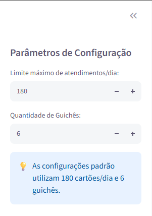
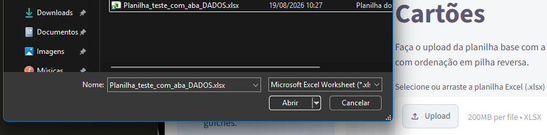
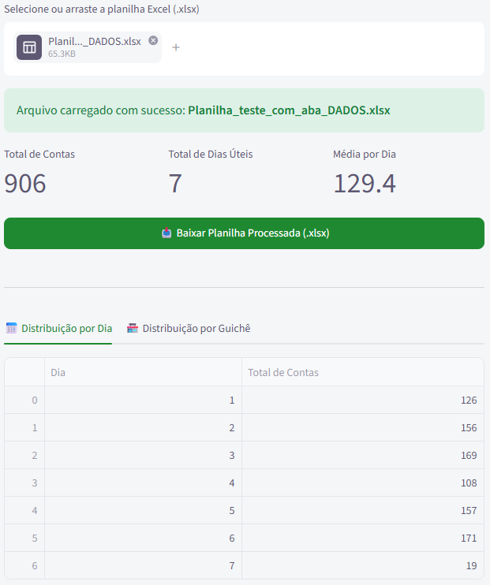
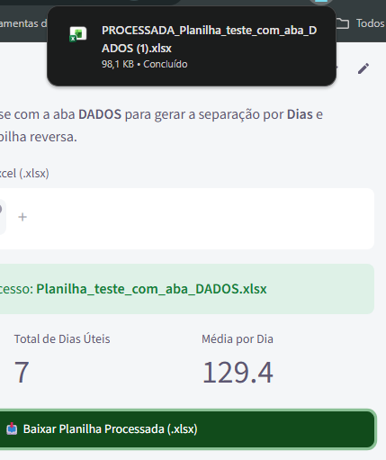

# 💳 Automação de Separação de Cartões - Instituto E-dinheiro

Este projeto é uma aplicação web desenvolvida para automatizar e otimizar o processo de triagem e entrega de cartões. A ferramenta processa planilhas brutas de clientes, agrupando-os por dia e distribuindo-os equitativamente entre os guichês de atendimento, gerando um arquivo final formatado e pronto para a operação física.

---

## 🛠️ Funcionalidades Principais

* **Agrupamento Inteligente:** Lê a aba `DADOS` e agrupa os nomes em ordem alfabética respeitando um limite diário de atendimentos (padrão: 180 cartões/dia).
* **Distribuição por Guichê:** Divide a carga diária de forma sequencial e igualitária entre os guichês de atendimento (padrão: 6 guichês).
* **Pilha Reversa de Confecção (Z para A):** A planilha final é gerada do último para o primeiro. Isso garante que, ao confeccionar ou empilhar os cartões fisicamente, o primeiro atendimento (Ordem 1) fique no topo da pilha.
* **Layout Padronizado:** Exporta automaticamente um arquivo `.xlsx` com as abas `LETRAS_DIAS`, `DADOS` e abas individuais para cada `GUICHE`, com a identidade visual da instituição.

---

## 📖 Guia de Uso Passo a Passo

Para utilizar a plataforma, siga os passos abaixo. 

### 1. Tela Inicial e Configuração
Na barra lateral esquerda, você pode ajustar as regras da operação (se necessário), como o limite máximo de clientes por dia e a quantidade de guichês operacionais.

> *Ajuste os parâmetros antes de carregar a planilha para que as regras sejam aplicadas corretamente.*

### 2. Upload da Planilha
Arraste e solte o arquivo `.xlsx` gerado pelo sistema (contendo a aba bruta `DADOS`) na área central da tela.

> *A plataforma processará os milhares de registros em poucos segundos.*

### 3. Análise de Resultados
Após o carregamento, a tela exibirá métricas importantes: o total de contas lidas, em quantos dias a operação foi dividida e a média diária de atendimentos. Você também pode navegar pelas abas inferiores para visualizar a distribuição exata.

### 4. Download do Arquivo Final
Basta clicar no botão vermelho/verde em destaque para baixar a sua planilha processada e formatada, pronta para a equipe do guichê!

---

## 💻 Feito com ❤️ Por Lucas Lira
